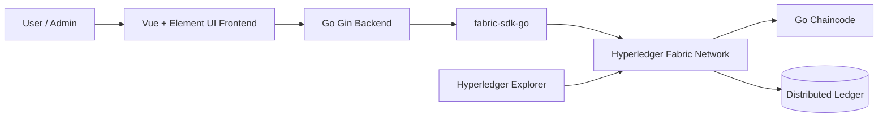

# Fabric Realty

Enterprise blockchain case study for a real-estate transaction workflow built on Hyperledger Fabric.

This repository demonstrates how a permissioned blockchain network can model property ownership, sales, transfers, and auditability across multiple business actors.

## Why This Project Matters

Real-estate transactions are a good fit for enterprise blockchain because they need:

- Shared state between multiple parties
- Clear asset ownership records
- Auditable transaction history
- Role-based access and workflow control
- Reliable backend integration with business applications

This project is useful as a learning and portfolio case for Hyperledger Fabric, Go chaincode, backend API integration, and enterprise-style blockchain architecture.

## Tech Stack

| Layer | Technology |
| --- | --- |
| Blockchain network | Hyperledger Fabric |
| Smart contract / chaincode | Go |
| Backend API | Go, Gin, fabric-sdk-go |
| Frontend | Vue, Element UI |
| Infrastructure | Docker, Docker Compose |
| Explorer | Hyperledger Explorer |

## System Architecture



## Business Workflow

The system models a permissioned real-estate workflow:

1. Admin creates real-estate assets for property owners.
2. Property owners view assets under their account.
3. Owners list properties for sale.
4. Buyers purchase listed properties and trigger payment-related workflow state.
5. Owners confirm payment receipt.
6. Ownership is updated on-chain after the transaction completes.
7. A transaction can be cancelled before completion or expire after the valid period.
8. Owners can also initiate property donation/transfer flows with recipient confirmation.

## Repository Structure

```text
application/server   Go backend using Gin and fabric-sdk-go
application/web      Vue + Element UI frontend
chaincode            Go chaincode for real-estate business logic
network              Hyperledger Fabric network configuration
network/explorer     Optional blockchain explorer setup
```

## Run Locally

Requirements:

- Linux environment
- Docker
- Docker Compose

Start the blockchain network and deploy chaincode:

```bash
cd network
./start.sh
```

Build and start the application:

```bash
cd application
./build.sh
./start.sh
```

Open the web app:

```text
http://localhost:8000/web
```

Optional explorer:

```bash
cd network/explorer
./start.sh
```

Open explorer:

```text
http://localhost:8080
username: admin
password: 123456
```

## What I Would Improve Next

To make this stronger as a production-grade enterprise blockchain project, I would add:

- English API documentation and request examples
- Chaincode unit tests for ownership, sale, cancellation, and transfer flows
- Architecture Decision Records explaining Fabric network design choices
- CI workflow for linting and test execution
- Clear screenshots/GIFs of the user workflow
- Security notes around identity, endorsement policy, and access control
- A smaller Docker quickstart for easier reviewer onboarding

## Portfolio Notes

This repository is currently positioned as an enterprise blockchain learning case. The most valuable next step is not adding more UI, but making the architecture and chaincode behavior easier for reviewers to verify quickly.

For remote Web3/blockchain roles, this project shows experience with:

- Permissioned blockchain concepts
- Asset modeling and ownership transfer
- Go-based chaincode and backend integration
- Dockerized blockchain development environments
- Full-stack blockchain application structure

## Related Profile

See my GitHub profile for the broader Web3 portfolio roadmap:

https://github.com/2hevva
